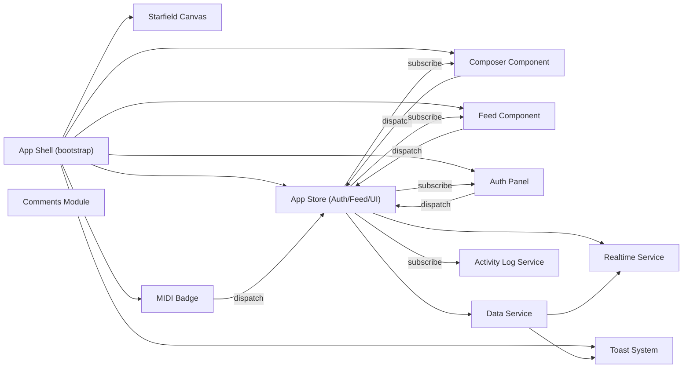

# Application Update Plan – PocketBase Cyber Plaza

## 1. Purpose
- Deconstruct the existing monolithic front-end into composable, testable units.
- Redesign event loops and state handling for clarity, resilience, and extensibility.
- Align stakeholders on a target architecture, phased roadmap, and visualization deliverables.
- Provide inputs for work-effort tracking (`work_efforts/00-09_project_management/01_work_efforts/00.07_application_overhaul.md`).

## 2. Current State Summary
- **Single-entry script**: `public/app.js` orchestrates rendering, state, I/O, and side-effects with tightly coupled DOM manipulation.
- **Implicit event flow**: DOM events directly manipulate PocketBase services; optimistic updates interleave with live subscription callbacks.
- **Limited component abstraction**: Only `ComposerComponent` and `toast` module exist; majority of UI generated inline.
- **Documentation gaps**: No authoritative system diagrams or lifecycle documentation to support onboarding or future audits.

## 3. Guiding Principles
- **Modular-first**: Favor explicit component boundaries (UI, state, services) with well-defined contracts.
- **State awareness**: Centralize session/feed/comment state via dedicated stores instead of implicit Maps scattered through the code.
- **Event transparency**: Replace ad-hoc listeners with a predictable pub/sub or state-machine-driven event loop.
- **Progressive enhancement**: Maintain existing UX while enabling incremental refactors.
- **Document as we build**: Each milestone includes updated diagrams, ADR-style decisions, and developer handoff notes.

## 4. Target Architecture Overview
### 4.1 Layered layout
- **Presentation Layer**: Framework-agnostic DOM components (Composer, Feed, Auth Panel, Navigation, Badges).
- **State Layer**: Central store(s) for auth, feed, comments, UI flags (e.g., using lightweight observable pattern or Redux-like store).
- **Service Layer**: Data service (PocketBase + Express API), Realtime service, Analytics/Telemetry, Utility helpers.
- **Application Shell**: Bootstraps services, hydrates stores, wires events, and renders root components.

### 4.2 Component & Service Relationships


### 4.3 Event & Data Lifecycles
```mermaid
sequenceDiagram
  participant UI as Composer UI
  participant Store as App Store
  participant Service as Data Service
  participant PB as PocketBase
  participant Feed as Feed UI

  UI->>Store: dispatch(createPostDraft(content))
  Store-->>UI: state.update(status="submitting", optimisticPost)
  Store->>Service: createPost(optimisticPost)
  Service->>PB: REST create
  PB-->>Service: saved record
  Service->>Store: commit(postSaved(realRecord))
  Store-->>Feed: state.update(feed.prepend(realRecord))
  Store-->>UI: state.update(status="idle")
  Store-->>Logger: log("Post published")
  Realtime note over Service,Feed: Realtime events reconcile via postUpdated/postDeleted actions
```

### 4.4 Reference Wireframe (ASCII)
```
+--------------------------------------------------------------+
| NAVBAR: Brand | Menu Toggle | Profile Avatar                 |
+--------------------------------------------------------------+
| Slide Menu (Auth, Stats, Log) | Main Column                  |
|                               | +--------------------------+ |
|                               | | Composer Card           | |
|                               | +--------------------------+ |
|                               | | Feed Header  Refresh    | |
|                               | +--------------------------+ |
|                               | | Feed Cards (scrollable) | |
|                               | +--------------------------+ |
|                               | | New Posts Banner        | |
|                               | +--------------------------+ |
|                               | | Loading Indicator       | |
|                               | +--------------------------+ |
|                               | | End-of-Feed Marker      | |
|                               | +--------------------------+ |
|                               | | Badges | Hit Counter    | |
|                               | +--------------------------+ |
+--------------------------------------------------------------+
```
_Use this as a starting point for higher fidelity wireframes (Figma/Excalidraw)._

## 5. Component Decomposition Roadmap
- **App Shell**: Bootstrapping, service initialization, hydration of stores.
- **Layout & Navigation**: Navbar, slide menu, overlays, responsive breakpoints.
- **Auth Module**: Login/Register forms, session persistence, avatar rendering.
- **Composer Module**: Form, validation, optimistic updates, error states.
- **Feed Module**: Post list, cards, voting controls, infinite scroll.
- **Comments Module**: Thread rendering, reply composer, moderation tools.
- **Telemetry & Logs**: Activity log tail, toast notifications, analytics hooks.
- **Decor & Experience**: Starfield canvas, MIDI toggle, retro badges.

Each module will gain:
1. Dedicated directory under `public/components/<module>`.
2. Pure rendering functions or templated markup.
3. Controller/service modules for business logic.
4. Jest-compatible unit test scaffold (post refactor).

## 6. Implementation Phases
| Phase | Focus | Key Deliverables | Dependencies |
| ----- | ----- | ---------------- | ------------ |
| 0. Discovery & Audit | Capture baseline metrics, inventory APIs/routes, confirm requirements | Code audit log, dependency map, design alignment meeting | None |
| 1. Architecture Foundations | Implement app store abstraction, module scaffolding, service facades | App shell bootstrap, store prototype, updated diagrams | Phase 0 |
| 2. UI Componentization | Migrate Composer, Auth, Feed, Comments into discrete modules | Component directories, interface docs, snapshot tests | Phase 1 |
| 3. Event Loop Refactor | Replace ad-hoc listeners with store-driven dispatch/subscribe | Event map, action constants, logger/tracing updates | Phase 2 |
| 4. Experience & Integrations | Rewire realtime, analytics, MIDI toggle, starfield lifecycle | Realtime service wrapper, feature toggles | Phase 3 |
| 5. Hardening & Launch | Performance tuning, accessibility review, documentation freeze | Benchmarks, A11y checklist, migration guide | Phase 4 |

## 7. Documentation & Visualization Deliverables
- **Architecture Diagrams**: Mermaid-based component and sequence diagrams (kept in `docs/architecture/` or embedded in this plan).
- **Event Loop Maps**: Swimlane/sequence diagrams for primary flows (composer submit, comment flow, auth cycle).
- **Wireframes**: Low-fidelity layout sketches (Figma or Excalidraw link) plus Markdown snapshots referencing asset paths.
- **Technical Design Records (TDRs)**: One per major module migration.
- **Testing Matrices**: Map unit/integration/e2e coverage expectations.

Assets should be stored under `docs/visuals/` (create directory) with source files and exported PNG/SVG snapshots. Link them in README or module docs.

## 8. Risk & Mitigation
- **Scope creep**: Enforce phase gates with acceptance criteria; track deltas in work-effort log.
- **Regression risk**: Introduce unit tests alongside refactors; maintain rollback plan by tagging milestones.
- **Realtime drift**: Verify subscription handlers after store introduction; add logging instrumentation.
- **Performance regression**: Benchmark feed render and scroll performance pre/post refactor.

## 9. Success Metrics
- 80% of UI logic resides in dedicated component modules.
- Critical flows (auth, post, comments) documented with diagrams and tests.
- Event loop actions cataloged with <= 5 core action types.
- Reduced `app.js` size by ≥60% with responsibilities distributed.

## 10. Immediate Next Actions
1. Publish matching work effort (`work_efforts/.../00.07_application_overhaul.md`) with scope, owners, and schedule.
2. Stand up `/docs/visuals/` hierarchy and seed with mermaid sources (this plan) + placeholders for wireframes.
3. Schedule architecture kick-off with stakeholders to validate phases and resource needs.
4. Populate OpenAI environment variables (`AI_PROVIDER`, `OPENAI_MODEL`, etc.) and store the API key in `secrets/openai_key.txt`.
5. Run `npm run verify:openai` to confirm GPT‑5-nano connectivity and capture the initial log entry in `logs/openai.log`.

---
_Maintained by: Architecture Working Group (initial draft via Codex)._
