# Architecture Documentation

**Last Updated:** 2025-10-19
**Version:** 1.0.0

## System Overview

The PocketBase Demo is a modern web application consisting of three main components:

1. **Frontend** - Static HTML/JS/CSS served via Nginx
2. **Express API** - Node.js REST API with validation and security
3. **PocketBase** - Backend database with real-time subscriptions

## High-Level Architecture

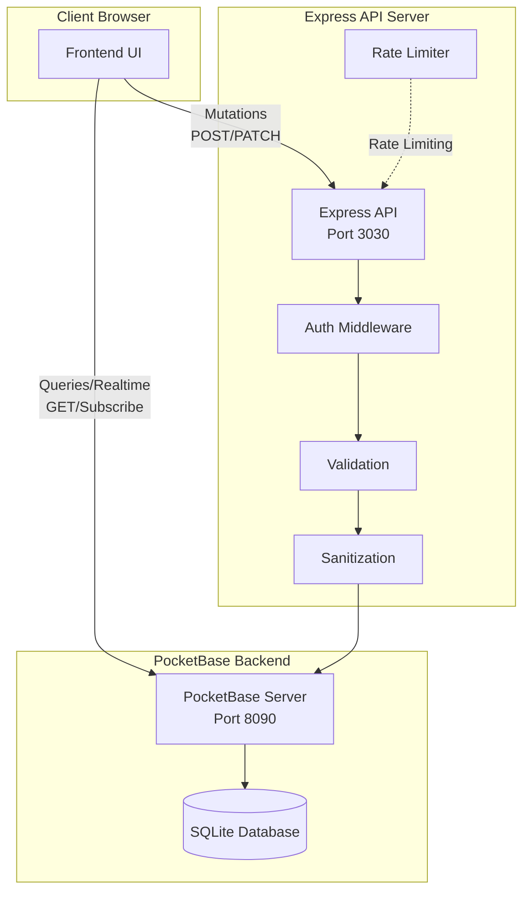

## Request Flow

### 1. Write Operations (POST/PATCH/DELETE)

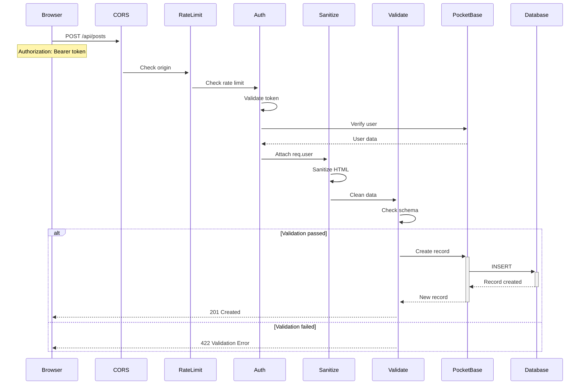

### 2. Read Operations (GET)

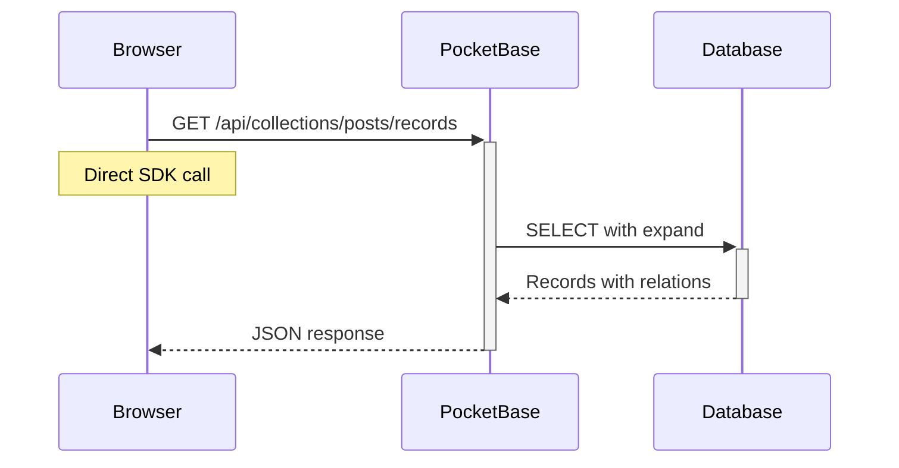

### 3. Real-time Updates (Subscribe)

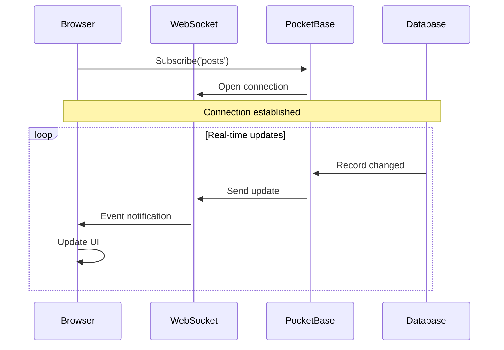

## Authentication Flow

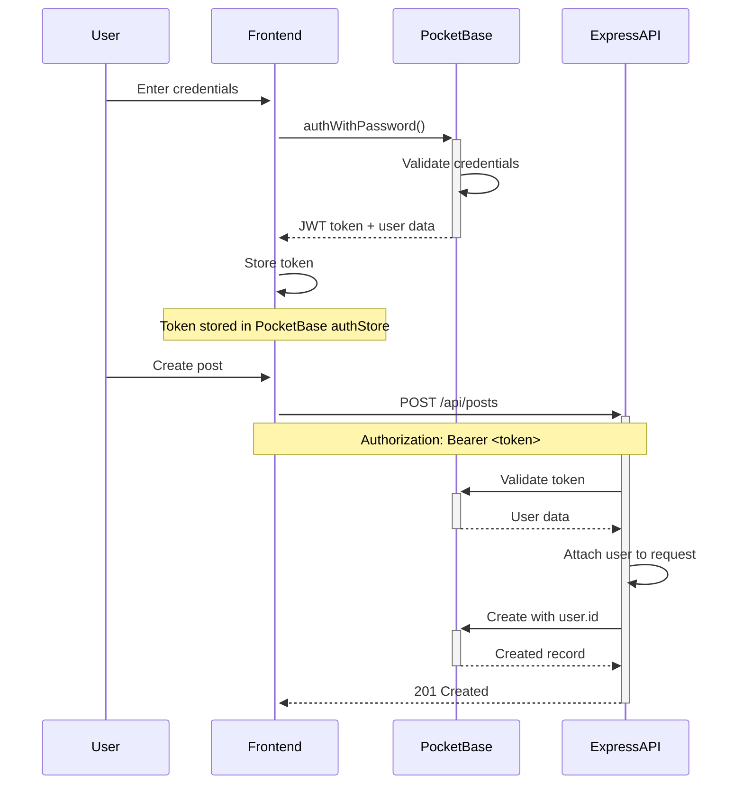

## Error Handling Flow

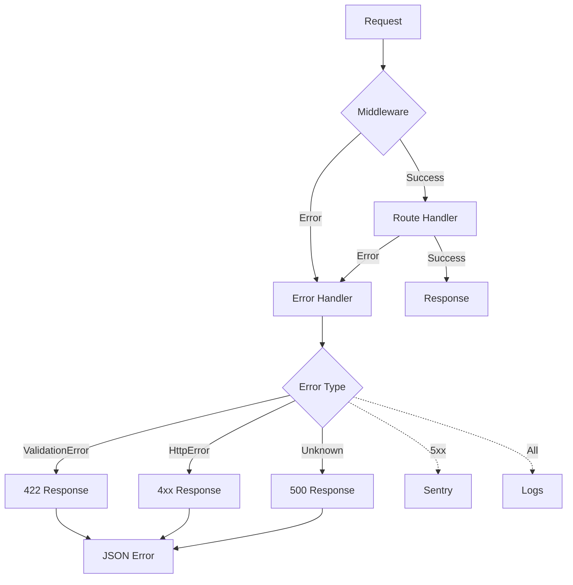

## Deployment Architecture

### Docker Compose Stack

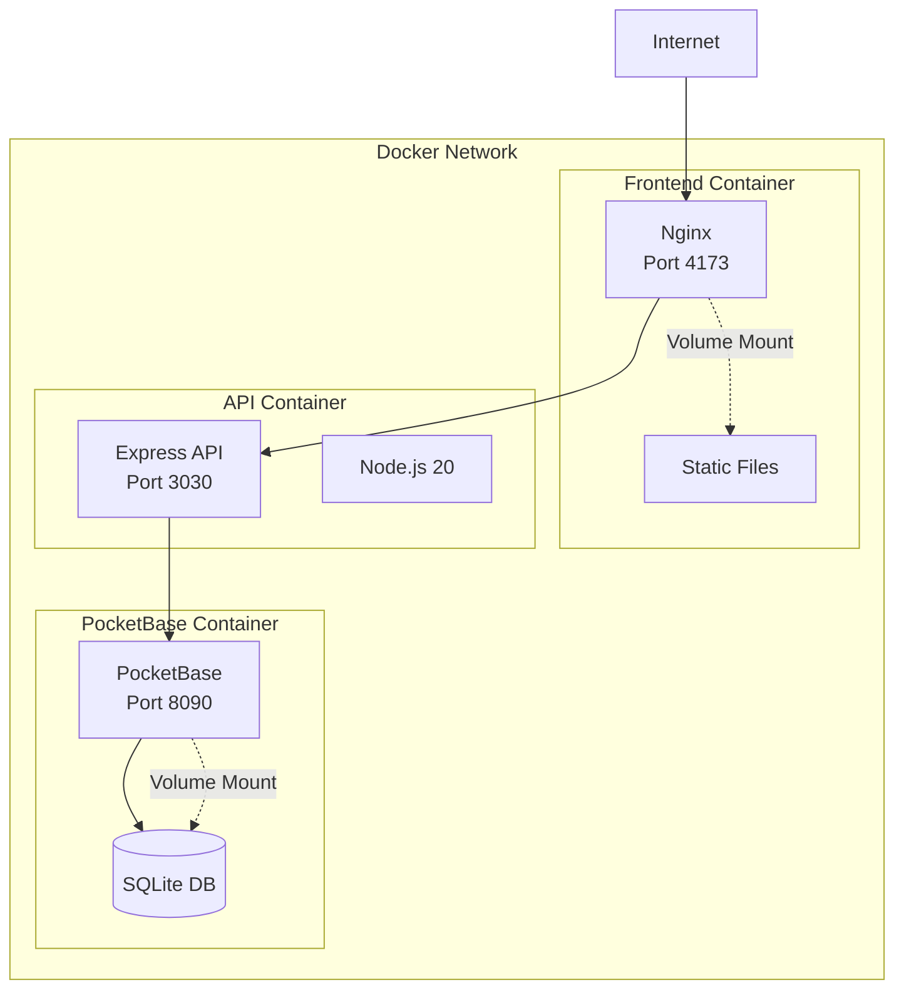

### Container Details

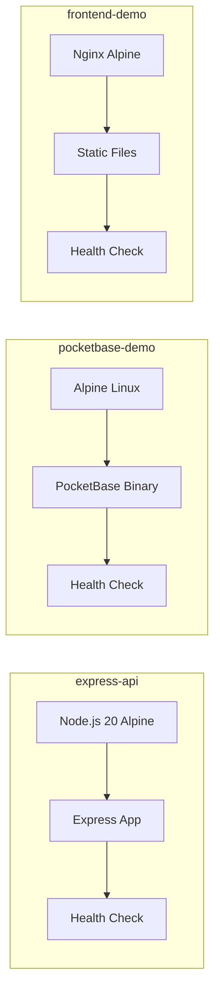

## Data Flow Patterns

### Optimistic UI Updates

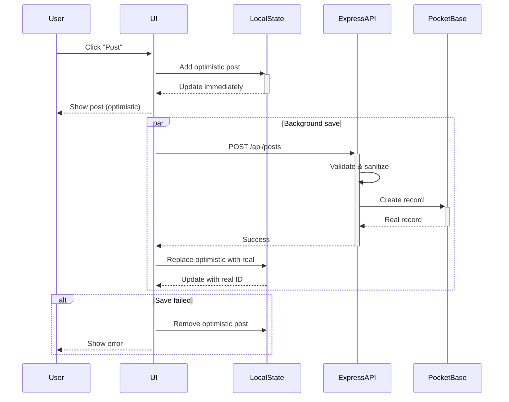

### Hybrid Read Pattern

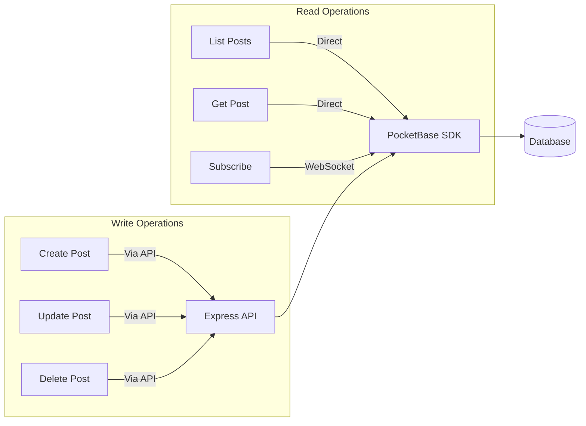

## Middleware Stack

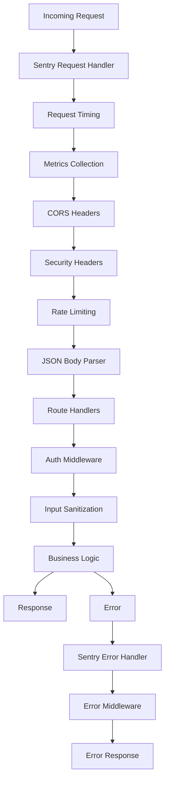

## Monitoring & Observability

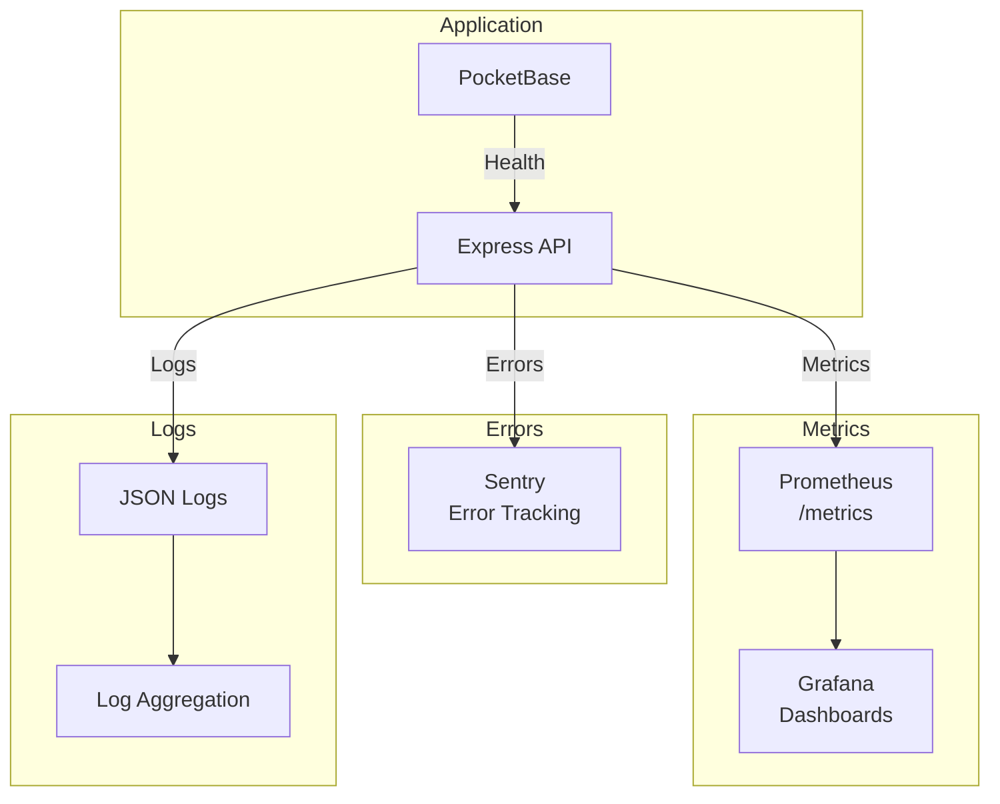

## Security Layers

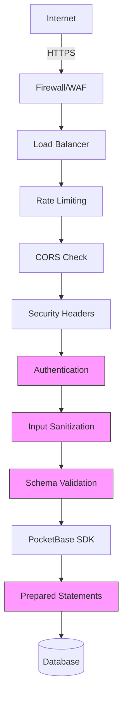

## Database Schema (PocketBase Collections)

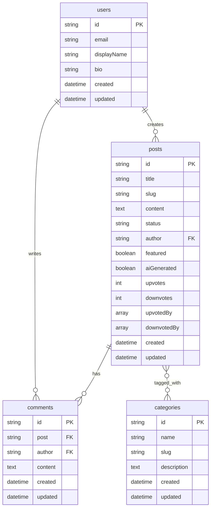

## File Structure

```
pocketbase-demo/
├── server/                    # Express API
│   ├── index.mjs             # Main server file
│   ├── config.mjs            # Configuration & validation
│   ├── middleware/           # Express middleware
│   │   ├── auth.mjs          # Authentication
│   │   ├── timing.mjs        # Request timing
│   │   └── metrics.mjs       # Prometheus metrics
│   ├── routes/               # API routes
│   │   ├── posts.mjs         # Posts endpoints
│   │   └── health.mjs        # Health checks
│   ├── services/             # Business logic
│   │   ├── pocketbaseClient.mjs  # PB client
│   │   ├── postService.mjs       # Post operations
│   │   └── errorTracking.mjs     # Sentry integration
│   ├── utils/                # Utilities
│   │   ├── errors.mjs        # Error classes
│   │   ├── logger.mjs        # Logging
│   │   └── sanitize.mjs      # Input sanitization
│   ├── docs/                 # API documentation
│   │   ├── openapi.yml       # OpenAPI spec
│   │   └── swagger.mjs       # Swagger setup
│   └── tests/                # Tests
│       ├── integration.test.mjs
│       ├── error-scenarios.test.mjs
│       └── load/             # Load tests
│
├── public/                   # Frontend
│   ├── index.html           # Main HTML
│   ├── app.js               # Main app logic
│   ├── components/          # UI components
│   ├── services/            # API & data services
│   ├── schemas/             # Zod validation schemas
│   └── utils/               # Utilities
│
├── docs/                    # Documentation
│   ├── ARCHITECTURE.md      # This file
│   ├── CONFIGURATION.md     # Config guide
│   ├── SECURITY.md          # Security docs
│   ├── LOAD_TESTING.md      # Load test guide
│   └── GAP_ANALYSIS.md      # Requirements analysis
│
├── pb_data/                 # PocketBase data
├── pb_migrations/           # Database migrations
├── Dockerfile              # API container
├── docker-compose.yml      # Full stack
├── nginx.conf             # Frontend server config
└── env.template           # Environment template
```

## Technology Stack

### Frontend
- **Vanilla JavaScript** - No framework overhead
- **PocketBase SDK** - Real-time subscriptions
- **Fetch API** - HTTP requests to Express API

### Backend API
- **Node.js 20** - Runtime
- **Express 4** - Web framework
- **PocketBase SDK** - Database client
- **Helmet** - Security headers
- **CORS** - Cross-origin resource sharing
- **express-rate-limit** - Rate limiting

### Database
- **PocketBase** - Backend as a service
- **SQLite** - Embedded database
- **Real-time subscriptions** - WebSocket updates

### Security
- **isomorphic-dompurify** - HTML sanitization
- **Zod** - Schema validation
- **JWT** - Authentication tokens

### Monitoring
- **Sentry** - Error tracking
- **Prometheus** - Metrics
- **prom-client** - Metrics collection

### Development
- **Node.js native test runner** - Unit tests
- **k6** - Load testing
- **Docker Compose** - Local development
- **Swagger** - API documentation

## Deployment Options

### 1. Local Development
```bash
npm run start
```
- All services run locally
- Hot reload enabled
- Debug logging

### 2. Docker Compose
```bash
docker-compose up -d
```
- All services containerized
- Production-like environment
- Volume mounts for data persistence

### 3. Production Deployment
- Kubernetes/Docker Swarm
- Separate scaling of services
- Load balancing
- Health checks
- Auto-restart policies

## Performance Characteristics

### Response Times (Baseline)
- Health check: <50ms
- List posts: <200ms
- Get single post: <100ms
- Create post: <300ms
- Update post: <250ms

### Throughput
- Sustained: ~1000 req/s
- Peak: ~2000 req/s (with rate limiting)
- Concurrent connections: ~1000

### Resource Usage
- Express API: ~100MB RAM
- PocketBase: ~50MB RAM
- Frontend: ~10MB (Nginx)

## Scalability

### Horizontal Scaling
- Multiple API instances behind load balancer
- Shared PocketBase instance
- Stateless API design

### Vertical Scaling
- Increase container resources
- Optimize database queries
- Add caching layer

## Related Documentation

- [Security](./SECURITY.md) - Security architecture and measures
- [Configuration](./CONFIGURATION.md) - Environment configuration
- [Load Testing](./LOAD_TESTING.md) - Performance testing
- [GAP Analysis](./GAP_ANALYSIS.md) - Requirements and gaps

